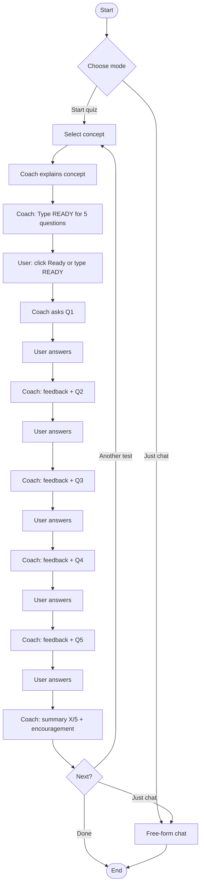
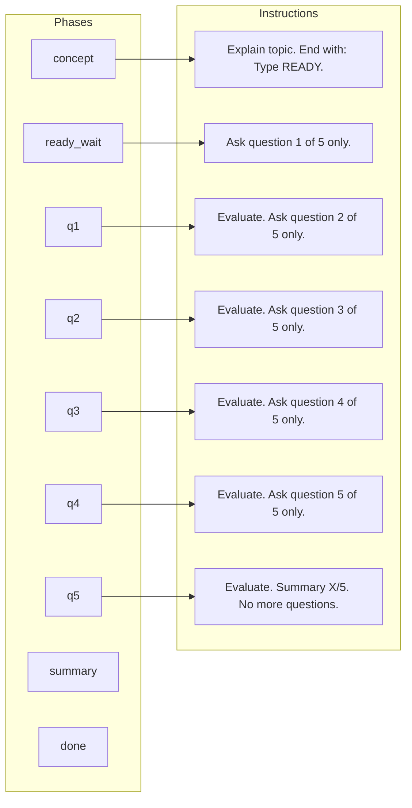
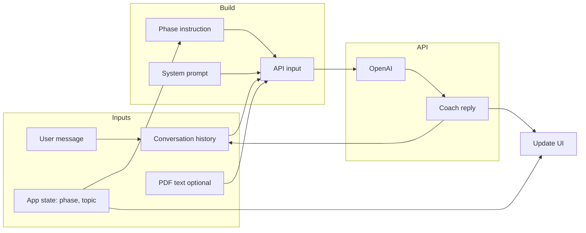

# Maths Olympiad Mentor – Architecture & Flow

## 1. High-level architecture

```
┌─────────────────────────────────────────────────────────────────────────────┐
│                              USER (Grade 6 student)                          │
└─────────────────────────────────────────────────────────────────────────────┘
                                        │
                                        ▼
┌─────────────────────────────────────────────────────────────────────────────┐
│                         GUI (Tkinter) or Web (FastAPI)                        │
│  ┌──────────────┐  ┌──────────────┐  ┌──────────────┐  ┌──────────────────┐ │
│  │ Start quiz / │  │ Load PDF     │  │ Chat log     │  │ Input + Send /   │ │
│  │ Just chat    │  │ (optional)   │  │ (messages)   │  │ Ready button     │ │
│  └──────────────┘  └──────────────┘  └──────────────┘  └──────────────────┘ │
└─────────────────────────────────────────────────────────────────────────────┘
     │                        │                    │                    │
     │                        │                    │                    │
     ▼                        ▼                    ▼                    ▼
┌─────────────────────────────────────────────────────────────────────────────┐
│                              APP LAYER                                       │
│  ┌─────────────────────┐  ┌─────────────────────┐  ┌─────────────────────┐  │
│  │ Mode                │  │ Test state          │  │ PDF context         │  │
│  │ • test | chat       │  │ • topic              │  │ • loaded_pdf_text   │  │
│  │                     │  │ • phase              │  │ • loaded_pdf_name   │  │
│  │                     │  │   (concept → q1..q5  │  │                     │  │
│  │                     │  │    → summary → done) │  │                     │  │
│  └─────────────────────┘  └─────────────────────┘  └─────────────────────┘  │
│                                                                               │
│  • Builds per-turn prompt (system + phase instruction + history)             │
│  • Sends request → receives reply → updates state & UI                        │
└─────────────────────────────────────────────────────────────────────────────┘
     │
     ▼
┌─────────────────────────────────────────────────────────────────────────────┐
│                              AGENT (OpenAI)                                  │
│  ┌─────────────────────┐  ┌─────────────────────┐  ┌─────────────────────┐  │
│  │ System prompt       │  │ PDF text (optional) │  │ Conversation        │  │
│  │ (coach persona +    │  │ injected into       │  │ history + current   │  │
│  │  formatting rules)  │  │ context             │  │ phase instruction   │  │
│  └─────────────────────┘  └─────────────────────┘  └─────────────────────┘  │
└─────────────────────────────────────────────────────────────────────────────┘
     │
     ▼
┌─────────────────────────────────────────────────────────────────────────────┐
│                         OpenAI API (e.g. gpt-5.2)                             │
└─────────────────────────────────────────────────────────────────────────────┘
```

---

## 2. Component responsibilities

| Component      | Responsibility |
|----------------|----------------|
| **GUI / Web**  | User input, show messages, “Start quiz” / “Just chat”, concept choice, **Ready** button (or type READY), Load PDF, progress (Concept → Q1…Q5 → Summary). |
| **App state**  | `mode` (quiz \| chat), `quiz_concept`, `quiz_phase`, optional `loaded_pdf_text`. |
| **App logic**  | On each user message: compute current phase, build phase-specific instruction, call agent with (history + phase instruction + optional PDF), then update phase and UI. |
| **Agent**      | Single `get_reply(history, pdf_text=..., phase_instruction=...)` that builds API input (system + PDF + history + phase instruction) and returns coach reply. |
| **OpenAI API** | Produces coach text (explanation, one question, feedback, or summary). |

---

## 3. State machine (test mode)

```
                    ┌─────────────┐
                    │   START     │
                    └──────┬──────┘
                           │ user: "Start test" + topic
                           ▼
                    ┌─────────────┐
                    │  CONCEPT    │  Coach explains concept; says "When ready, type READY" or click Ready
                    └──────┬──────┘
                           │ user: "READY" or clicks **Ready** button
                           ▼
                    ┌─────────────┐
                    │  READY_WAIT │  (transient) → next: ask Q1
                    └──────┬──────┘
                           │
                           ▼
    ┌──────────────► ┌─────────────┐
    │                │    Q1       │  Coach asks question 1 only
    │                └──────┬──────┘
    │                        │ user: answer
    │                        ▼
    │                ┌─────────────┐
    │                │    Q2       │  Coach evaluates, asks question 2 only
    │                └──────┬──────┘
    │                        │
    │         ... same for Q3, Q4, Q5 ...
    │                        │
    │                        ▼
    │                ┌─────────────┐
    │                │    Q5       │  Coach evaluates, asks question 5 only
    │                └──────┬──────┘
    │                        │ user: answer
    │                        ▼
    │                ┌─────────────┐
    │                │  SUMMARY    │  Coach evaluates + "You got X/5" + encouragement
    │                └──────┬──────┘
    │                        │
    │                        ▼
    │                ┌─────────────┐
    └────────────────│    DONE     │  Option: "Start another test" or "Just chat"
                     └─────────────┘
```

---

## 4. User flow (sequence)

```
  User           GUI              App state           Agent              OpenAI
   │               │                    │                │                  │
   │  Start quiz   │                    │                │                  │
   │  Concept: "Divisibility"             │                │                  │
   │──────────────►│  phase=explain     │                │                  │
   │               │  quiz_concept=...  │                │                  │
   │               │  build: system + "Explain concept, then say type READY"  │
   │               │─────────────────────────────────────►│─────────────────►│
   │               │                    │                │◄─────────────────│
   │               │  show explanation  │                │                  │
   │◄──────────────│  "When ready, click Ready or type READY"                │
   │               │                    │                │                  │
   │  READY        │                    │                │                  │
   │──────────────►│  phase=q1          │                │                  │
   │               │  build: history + "Ask question 1 of 5 only"            │
   │               │─────────────────────────────────────►│─────────────────►│
   │               │                    │                │◄─────────────────│
   │◄──────────────│  show Q1           │                │                  │
   │               │                    │                │                  │
   │  Answer 1     │                    │                │                  │
   │──────────────►│  phase=q2          │                │                  │
   │               │  build: history + "Evaluate, then ask Q2 only"          │
   │               │─────────────────────────────────────►│─────────────────►│
   │               │                    │                │◄─────────────────│
   │◄──────────────│  show feedback + Q2│                │                  │
   │               │                    │                │                  │
   │  ...          │  ...               │  ...           │  ...              │
   │               │                    │                │                  │
   │  Answer 5     │  phase=summary     │                │                  │
   │──────────────►│  build: "Evaluate, then summary X/5, no more questions" │
   │               │─────────────────────────────────────►│─────────────────►│
   │◄──────────────│  show summary      │  phase=done    │                  │
   │               │                    │                │                  │
   │  Start another test / Just chat    │                │                  │
   │──────────────►│  reset or switch mode               │                  │
```

---

## 5. Flow diagram (Mermaid)

### 5.1 Main user flow



### 5.2 Phase → prompt injection



### 5.3 Data flow (test mode, one turn)



---

## 6. File / module map

```
openai/math-olympiad-mentor/
├── agent.py              # get_reply(..., pdf_text, phase_instruction), extract_pdf_text
├── app_gui.py            # Tkinter GUI: state (mode, quiz_phase, quiz_concept), Ready button, send + phase logic
├── web_app.py            # FastAPI web app: same quiz flow, Ready button, /api/chat, /api/concepts
├── requirements.txt      # openai, pypdf (GUI)
├── requirements-web.txt  # + fastapi, uvicorn (web)
├── k8s/                  # Deployment, Service (optional Ingress)
└── docs/
    ├── architecture-and-flow.md
    └── using-ollama.md
```

---

## 7. Summary

| Item | Description |
|------|-------------|
| **Architecture** | GUI → App state & logic → Agent (builds prompt) → OpenAI API. |
| **Flow** | Start quiz → Concept → Explain → **Ready** (button or type READY) → Q1 → answer → … → Q5 → answer → Summary → Done. |
| **State** | `mode`, `quiz_concept`, `quiz_phase` (explain \| q1..q5 \| summary \| done). |
| **Key mechanism** | App injects a **phase instruction** every turn so the coach does exactly one thing (explain, ask one question, evaluate + next question, or summary). |
| **PDF** | Optional; if present, injected into context so concept/questions can be from the PDF. |
